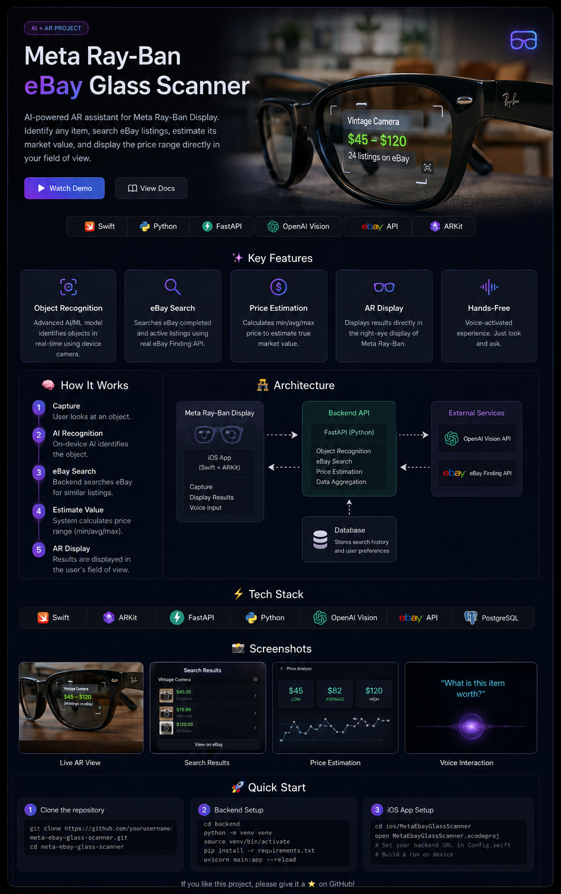

# 👓 Meta Ray-Ban eBay Glass Scanner

<p align="center">
  <strong>Look at it. Wait. Know what it's worth.</strong>
</p>

<p align="center">
  An AI-powered AR resale assistant concept for Meta Ray-Ban Display.
</p>

<p align="center">


</p>

---

<p align="center">
  
</p>

<p align="center">
  <em>
    A concept prototype showing how a wearable camera + AI + marketplace data
    could turn any physical object into an instant resale estimate.
  </em>
</p>

---

## ✨ The Idea

Imagine walking through a thrift store, garage sale, flea market, or your own collection.

You see an interesting item.

You look at it.

After a few seconds, the glasses understand what you're looking at, search eBay, estimate the current market range, and surface the result directly on the **Meta Ray-Ban Display**.

No phone.

No typing.

No manual search.

Just look.

### Example

```text
┌───────────────────────────────┐
│                               │
│      Vintage Camera           │
│                               │
│      $45 — $120               │
│                               │
│      Median: $82              │
│      24 comparable listings   │
│                               │
└───────────────────────────────┘
```

The goal is to make **physical-world price discovery as frictionless as web search.**

---

# 🧠 How It Works

```text
             👓
      Meta Ray-Ban Display
              │
              │ Camera
              ▼
       ┌───────────────┐
       │ Stable Object │
       │    Trigger    │
       └───────┬───────┘
               │
               ▼
       ┌───────────────┐
       │  Vision / AI  │
       │ Object ID     │
       └───────┬───────┘
               │
               ▼
       ┌───────────────┐
       │ Search Query  │
       │ Normalization │
       └───────┬───────┘
               │
               ▼
       ┌───────────────┐
       │   eBay API    │
       │ Marketplace   │
       │    Search     │
       └───────┬───────┘
               │
               ▼
       ┌───────────────┐
       │ Price Engine  │
       │ Filtering     │
       │ Median/Range  │
       └───────┬───────┘
               │
               ▼
       ┌───────────────┐
       │ AR Result     │
       │ Right-eye     │
       │   Display     │
       └───────────────┘
```

---

# 🚀 Product Flow

### 01 — Look

The user points the Meta glasses at an object.

### 02 — Stabilize

The system waits until the object remains in view long enough to indicate intentional inspection.

The initial prototype uses a configurable trigger rather than continuously uploading camera frames.

### 03 — Identify

A vision model determines what the object is and generates a normalized marketplace search query.

```text
Camera image

      ↓

"Handheld Nintendo Game Boy Color,
Atomic Purple, used"
```

### 04 — Search

The backend queries eBay for comparable listings.

### 05 — Estimate

Prices are cleaned and analyzed to reduce the influence of extreme outliers.

```text
Comparable listings

$69
$74
$79
$82
$85
$89
$95
$99
$110
$129

        ↓

Low       $79
Median    $89
High      $110
```

### 06 — Display

The result is compressed into a glanceable AR card.

```text
Nintendo Game Boy Color

$79 — $110
Median $89

eBay · 24 listings
```

---

# 🎯 Why This Is Interesting

Most resale workflows currently look like:

```text
Find object
   ↓
Take photo
   ↓
Open phone
   ↓
Open marketplace
   ↓
Type search
   ↓
Compare listings
   ↓
Estimate value
```

This project explores:

```text
Look
 ↓
Understand
 ↓
Search
 ↓
Estimate
 ↓
Display
```

The interesting engineering problem is not simply recognizing an object.

It's creating a **low-friction wearable information loop** between:

**physical world → computer vision → marketplace data → human decision**

---

# 🧩 Key Features

| Feature                 | Description                                                    |
| ----------------------- | -------------------------------------------------------------- |
| 👁️ Object Recognition  | Converts a physical object into a searchable product concept   |
| 🔎 eBay Search          | Finds comparable marketplace listings                          |
| 📊 Price Estimation     | Calculates a robust market range and median                    |
| 🧹 Outlier Filtering    | Reduces the effect of unusually high/low listings              |
| 👓 AR Display           | Designed for glanceable right-eye information                  |
| ⚡ Low-Friction UX       | No phone interaction required for the target experience        |
| 🧱 Modular Architecture | Vision, marketplace, pricing and wearable layers are separated |
| 🧪 Mock Mode            | Entire backend can be demonstrated without API credentials     |

---

# 🏗️ Architecture

```text
┌──────────────────────────────────────────────────────────┐
│                  META RAY-BAN DISPLAY                    │
│                                                          │
│   Camera       Display       User Interaction            │
└─────────┬──────────┬─────────────────────────────────────┘
          │          ▲
          │          │
          ▼          │
┌──────────────────────────────────────────────────────────┐
│                    iOS COMPANION                         │
│                                                          │
│  Swift / SwiftUI                                        │
│  Meta Wearables Adapter                                 │
│  Camera Capture                                         │
│  Display Rendering                                      │
└──────────────────────────┬───────────────────────────────┘
                           │
                           │ HTTPS
                           ▼
┌──────────────────────────────────────────────────────────┐
│                    BACKEND API                           │
│                                                          │
│  FastAPI                                                 │
│                                                          │
│  ┌──────────────┐   ┌──────────────┐                    │
│  │ Vision Layer │ → │ Query Engine │                    │
│  └──────────────┘   └──────┬───────┘                    │
│                            │                             │
│                            ▼                             │
│                    ┌──────────────┐                     │
│                    │ eBay Client  │                     │
│                    └──────┬───────┘                     │
│                           │                             │
│                           ▼                             │
│                    ┌──────────────┐                     │
│                    │ Price Engine │                     │
│                    └──────────────┘                     │
└───────────────────────────┬──────────────────────────────┘
                            │
                            ▼
                    ┌────────────────┐
                    │   eBay API     │
                    └────────────────┘
```

---

# 🔬 Technical Design

The project intentionally separates the system into independent layers.

### Vision Layer

```python
class VisionProvider:
    async def identify(self, image):
        ...
```

The vision model can be replaced without changing the marketplace or pricing layers.

---

### Marketplace Layer

```python
class EbayClient:
    async def search(self, query):
        ...
```

This keeps eBay-specific authentication and API calls isolated from the rest of the application.

---

### Pricing Layer

```python
estimate_prices(prices)
```

The pricing engine:

1. removes invalid values;
2. sorts comparable prices;
3. optionally trims extreme values;
4. calculates a median;
5. produces a low/high estimate.

The goal is not to pretend that a marketplace asking price is an exact valuation.

---

# 📈 Why Median?

Consider:

```text
$42
$47
$52
$55
$58
$61
$63
$65
$69
$400
```

A simple average becomes misleading because of the $400 outlier.

A median-based estimator is considerably more robust:

```text
Median ≈ $59.50
```

For a resale assistant, **robust estimation is more useful than a deceptively precise number.**

---

# ⚠️ Asking Price vs. Sold Price

One important limitation is intentional.

The current MVP primarily uses **active eBay listings**.

That means the result represents an:

> **asking-price estimate**

rather than a guaranteed realized sale price.

For example:

```text
Listed for:       $150
Actually sold for: $90
```

These are not equivalent.

A future version can incorporate approved sold/completed-sale data where available and legally accessible.

---

# 🛠️ Tech Stack

### Wearable / Client

* Swift
* SwiftUI
* Meta Wearables Device Access Toolkit
* Camera integration
* Display integration

### Backend

* Python
* FastAPI
* Pydantic
* HTTPX

### AI

* Vision-capable model
* Object identification
* Query normalization

### Marketplace

* eBay Browse API
* OAuth 2.0
* Marketplace search

### Development

* Git
* GitHub
* XCTest
* GitHub Actions

---

# 📂 Repository Structure

```text
meta-ebay-glass-scanner/
│
├── assets/
│   ├── hero.png
│   ├── architecture.png
│   └── demo-flow.png
│
├── backend/
│   ├── app/
│   │   ├── ebay.py
│   │   ├── pricing.py
│   │   ├── vision.py
│   │   ├── models.py
│   │   ├── config.py
│   │   └── main.py
│   │
│   ├── requirements.txt
│   └── .env.example
│
├── ios/
│   ├── MetaEbayScanner/
│   │   ├── ContentView.swift
│   │   ├── ScannerAPI.swift
│   │   ├── ScannerViewModel.swift
│   │   ├── Models.swift
│   │   ├── MetaWearablesAdapter.swift
│   │   └── MetaEbayScannerApp.swift
│   │
│   └── MetaEbayScannerTests/
│
├── docs/
│   ├── ARCHITECTURE.md
│   ├── DEMO.md
│   └── ROADMAP.md
│
├── .github/
│   └── workflows/
│
├── .env.example
├── CONTRIBUTING.md
├── LICENSE
├── SECURITY.md
└── README.md
```

---

# ⚡ Quick Start

## 1. Clone

```bash
git clone https://github.com/YOUR_USERNAME/meta-ebay-glass-scanner.git

cd meta-ebay-glass-scanner
```

---

## 2. Start the Backend

```bash
cd backend

python3 -m venv .venv

source .venv/bin/activate

pip install -r requirements.txt
```

Create the environment file:

```bash
cp .env.example .env
```

For a local demo:

```env
MOCK_MODE=true
```

Start FastAPI:

```bash
uvicorn app.main:app --reload --port 8080
```

Open:

```text
http://127.0.0.1:8080/docs
```

---

# 🧪 Try the API

```bash
curl -X POST http://127.0.0.1:8080/api/scan \
  -H "Content-Type: application/json" \
  -d '{"query":"Nintendo Game Boy Color Atomic Purple"}'
```

Example response:

```json
{
  "item": {
    "name": "Nintendo Game Boy Color Atomic Purple",
    "query": "Nintendo Game Boy Color Atomic Purple",
    "confidence": 1.0
  },
  "estimate": {
    "currency": "USD",
    "low": 79,
    "median": 89,
    "high": 110,
    "sample_size": 11,
    "source": "eBay active listings"
  }
}
```

---

# 🔑 eBay Configuration

Create an eBay developer application and configure:

```env
MOCK_MODE=false

EBAY_CLIENT_ID=your_client_id
EBAY_CLIENT_SECRET=your_client_secret

EBAY_MARKETPLACE_ID=EBAY_US
```

The backend uses the eBay OAuth client-credentials flow to obtain an application access token.

---

# 👓 Meta Display Integration

The wearable integration is isolated behind:

```swift
protocol MetaWearablesAdapter {
    var isConnected: Bool { get }

    func startCamera() async throws

    func capturePhoto() async throws -> Data

    func showOnDisplay(
        title: String,
        low: Double,
        median: Double,
        high: Double
    ) async throws
}
```

This makes it possible to develop and test the entire product pipeline without requiring the physical glasses.

The repository currently includes:

```swift
MockMetaWearablesAdapter
```

and a dedicated:

```swift
MetaDATAdapter
```

integration boundary.

The exact Meta Wearables Device Access Toolkit APIs should be wired according to the SDK version available to the developer, since the wearable SDK is evolving.

---

# 🎬 Demo Concept

The intended final demo looks like this:

```text
                    USER

              👓 looks at item
                       │
                       │
                       ▼
             ┌─────────────────┐
             │  Object stable  │
             │     3–10 sec    │
             └────────┬────────┘
                      │
                      ▼
                📷 Capture
                      │
                      ▼
                 🤖 Vision
                      │
                      ▼
              "Vintage Camera"
                      │
                      ▼
                 🔎 eBay
                      │
                      ▼
              ┌──────────────┐
              │ $45 — $120   │
              │ Median $82   │
              └──────┬───────┘
                     │
                     ▼
                    👁️
             Right-eye Display
```

---

# 🧭 Roadmap

### Phase 1 — Foundation

* [x] FastAPI backend
* [x] eBay API client
* [x] OAuth authentication
* [x] Price normalization
* [x] Median/range calculation
* [x] Mock mode
* [x] iOS architecture
* [x] Wearable adapter abstraction

### Phase 2 — Computer Vision

* [ ] Image upload endpoint
* [ ] Vision model integration
* [ ] Object confidence scoring
* [ ] Product/category normalization
* [ ] Condition detection

### Phase 3 — Wearable Prototype

* [ ] Meta camera integration
* [ ] Real Display integration
* [ ] Device/session lifecycle
* [ ] Stable-view trigger
* [ ] 10-second intentional-look mode
* [ ] Display result card

### Phase 4 — Resale Intelligence

* [ ] Sold/completed-sale data where available
* [ ] Category-aware pricing
* [ ] Condition-aware estimates
* [ ] Shipping cost normalization
* [ ] Seller/listing quality scoring
* [ ] Confidence score

### Phase 5 — Product UX

* [ ] "Good Deal" detection
* [ ] Store-price input
* [ ] Estimated resale margin
* [ ] Favorites
* [ ] Scan history
* [ ] Voice interaction
* [ ] Offline caching

---

# 💡 Future Experience

The long-term concept goes beyond:

> "How much is this worth?"

It becomes:

```text
┌───────────────────────────────────┐
│ Nintendo Game Boy Color           │
│                                   │
│ eBay Market                       │
│ $79 — $110                        │
│ Median $89                        │
│                                   │
│ Store price: $25                  │
│                                   │
│ Estimated margin                  │
│ +$64                              │
│                                   │
│        ★ GOOD DEAL                │
└───────────────────────────────────┘
```

This transforms the glasses into a **real-time resale decision assistant**.

---

# 🧪 Testing Strategy

The project is designed to be testable at multiple layers.

### Unit Tests

Test:

* price filtering;
* median calculation;
* percentile calculation;
* malformed marketplace data;
* API error handling.

### Integration Tests

Test:

```text
API
 ↓
eBay client
 ↓
pricing engine
 ↓
response
```

### Wearable Tests

Test:

```text
Camera
 ↓
Image capture
 ↓
Vision
 ↓
Marketplace
 ↓
Display
```

### UX Tests

Measure:

* time to result;
* false scan rate;
* incorrect object identification;
* display readability;
* interaction frequency;
* API latency.

---

# 🔐 Privacy & Security

The system is designed around an explicit scan model rather than continuous image uploading.

Principles:

* Don't upload camera frames unnecessarily.
* Capture only when a scan is triggered.
* Keep API credentials server-side.
* Never commit `.env` files.
* Do not expose eBay credentials in the iOS client.
* Clearly communicate when camera data is being processed.
* Follow applicable Meta wearable and marketplace API requirements.

---

# 🧠 Engineering Decisions

### Why a backend?

Marketplace credentials and API secrets should not live inside the wearable client.

The backend also gives us a centralized place for:

* AI processing;
* marketplace aggregation;
* price normalization;
* caching;
* rate limiting;
* analytics.

### Why an adapter?

Hardware APIs evolve.

Keeping Meta-specific functionality behind:

```swift
MetaWearablesAdapter
```

allows the rest of the application to remain independent from SDK changes.

### Why median instead of average?

Marketplace prices contain outliers.

Median provides a more robust representation of the center of the observed market.

---

# 🏆 What This Project Demonstrates

This project combines several areas of software engineering:

```text
Computer Vision
       +
Wearable Computing
       +
AR / Spatial UX
       +
REST APIs
       +
OAuth
       +
Marketplace Data
       +
Data Analysis
       +
Mobile Development
       +
Testing
```

The project is intentionally built as a modular prototype so individual components can be replaced without redesigning the entire system.

---

# 📸 Project Preview

<p align="center">
  
</p>

<p align="center">
  <em>
    Concept visualization of the target wearable experience.
  </em>
</p>

---

# 🔮 The Bigger Idea

The interesting part isn't eBay.

The interesting part is the interaction model:

> **What if the physical world became searchable simply by looking at it?**

A pair of glasses can turn:

```text
Object
  ↓
Understanding
  ↓
Context
  ↓
Action
```

into one continuous interaction.

This project explores that idea through the specific use case of **real-time resale intelligence**.

---

# ⭐ Status

> **Prototype / Research Project**

The backend and marketplace pipeline are implemented and runnable locally.

The Meta wearable layer is architected behind a dedicated adapter and is intended for integration with the currently available Meta Wearables Device Access Toolkit.

---

# 📄 License

MIT License.

---

<p align="center">

### 👓 Look at it. Know what it's worth.

If you find the concept interesting, consider giving the project a ⭐

</p>

